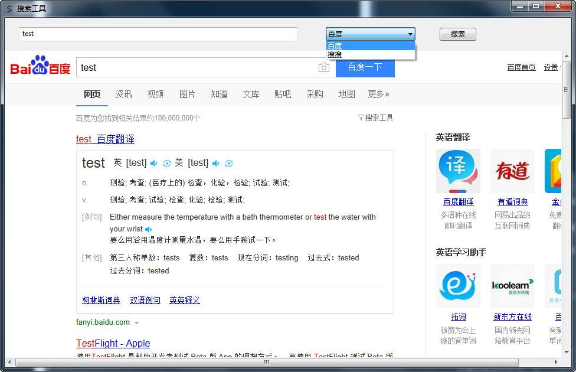

# 搜索工具
可以选择和配置搜索引擎, 然后搜索.

## 功能
- 使用 .ini 文件设置搜索引擎和关键词
- 保存和读取上次使用记录

## 运行方式
- 双击启动.
- 在左上角第一个输入框输入关键词, 选择搜索引擎, 点击搜索即可
- 能够使用所选择的搜索引擎, 搜索出结果则为正常
- 配置文件保存在 `etting.ini` 中

## 运行环境
- 系统版本: 如 `win7 x64 sp1`
- aar版本: 如 `aar v27.4`
- 无所需依赖库

## 知识积累
- 知识点
  - 控件设置固定边距可以有效避免改变窗口时位置错乱
  - `IcoFX` 软件可用于制作应用程序图标
  - `wb.noScriptErr` 禁用脚本错误
  - `wb.NewWindow3` 禁止在程序外部打开网页
  - `.ini` 配置, 以及配置值存取方式
- 参考
  - aardio公开教程资源/01 aardio快速入门视频教程/快速入门 第02课 实例-VIP视频播放器

## 附
- 作者: xw
